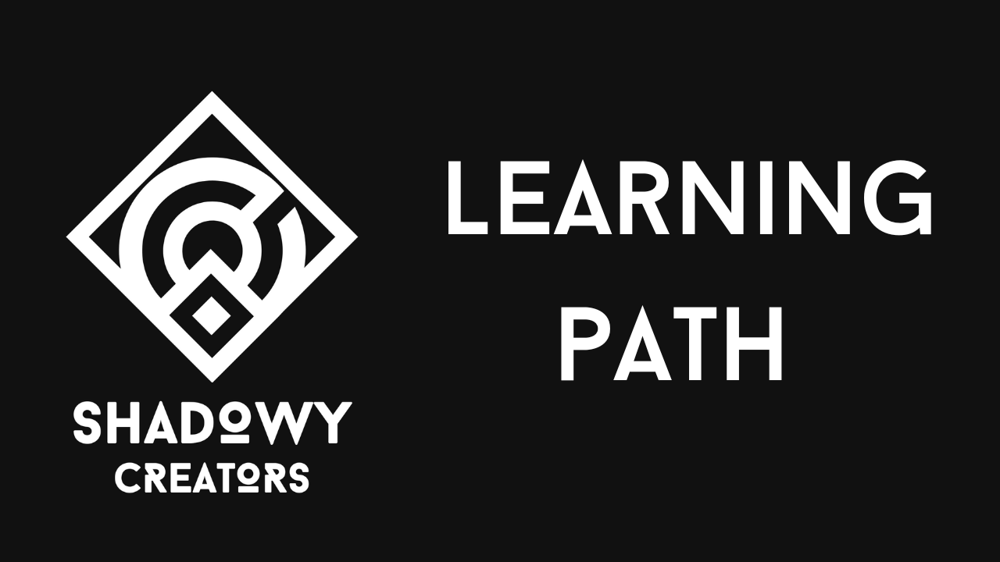

# 🥷🏻 Shadowy Learning Path Challenges



> The Shadowy Learning Path it's still in **beta** and will change very often.

Welcome to the repository that contains the challenges for the **Shadowy Learning Path**! Here you'll find, for each path (_frontend_, _backend_ or _contracts_) and each level the challenge you **must** complete in order to obtain the badge!

## ❓ How does it work?

Since we're still working on a website where to handle all the challenges, we decided to create this repository for the public to tackle the challenges we propose inside our learning path.

There are 3 main folders inside the `root` directory, one for each path. Inside each folder, there are all the folders relative to each level (eg. `level-2` inside the `frontend` folder is where there is the challenge for the fourth level of the Frontend path).

Each level folder contains a `README.md` file, a `exercise.spec.ts` code file that you'll need to fill and a `BADGES.md` file:

- The `README.md` file contains all the instructions for the challenge, and **must be read before writing any code**;
- The code files, if present, are what you'll need to fill and run in order to pass the challenge;
- The `BADGES.md` file contains all the users that tackled correctly that challenge.

## 📚 Challenge verification

After you've finished writing your code in your forked repository, you'll create a PR (pull request) on this repository updating **ONLY** (do not submit PRs with more files committed, it will be rejected) the `BADGES.md` file with your username and the link to your forked repo.

In order to speed-up the challenge verification process, we created a Telegram group (`@TODO`) where you can ping one of the Shadowers to go and check your newly submitted PR: if you succeeded in beating the challenge, your pull request will be accepted and your name will appear in the `BADGES.md` file.

## 🔌 CLI setup

Before running any exercise, you must fork this repository into your GitHub account. After you've done so, clone the repository locally on your pc (make sure to replace `<YOUR_USERNAME>` with your GitHub username):

```bash
git clone https://github.com/<YOUR_USERNAME>/learning-path-challenges.git
```

When the repository is finally cloned, enter the directory and install the dependencies (you need to have **node** and **npm** installed):

```bash
cd learning-path-challenges
npm install // or `yarn install`
```

After installing the dependencies, you start the CLI by running the following command inside the directory:

```bash
npm run exercise // or `yarn run exercise`
```

If everything went ok, it should prompt you the following screen:


Now you can easily run any exercise from any path from here!

If you don't want to use everything the CLI UI, you can select with path and relative level to test by passing them as arguments in the command line:

```bash
npm run exercise frontend 1 // or 'yarn run exercise frontend 1'
```

This example will run the `level-1` test for the `frontend` path.

## 🤖 Completing challenges and running exercises

Under each path folder there are all the levels with their relative challenge (file `exercise.spec.ts`) you need to complete in order to obtain the badge.

Some exercises may require you to complete other types of files, such as `.sol` or `.html` for the `Contracts` and `Frontend` paths. Everything is written in the `README.md` file under each level folder, so make sure you read it before proceeding with the exercises!

In order to complete a challenge you need to resolve the problem inside the test file and run it using the CLI.
